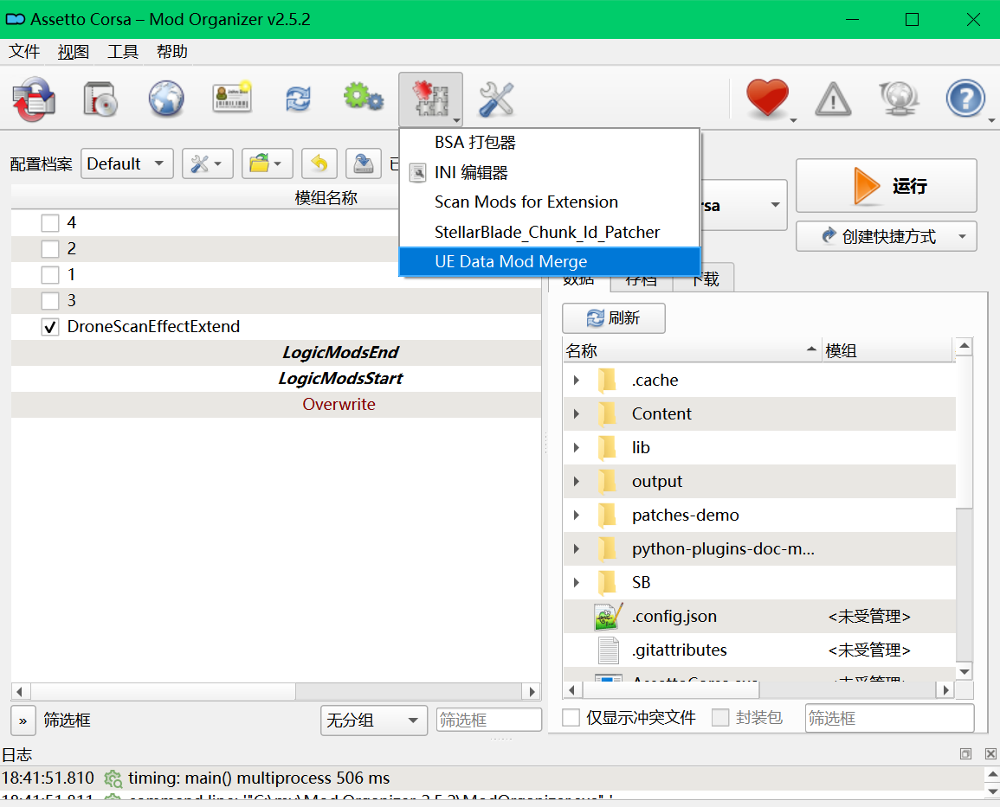
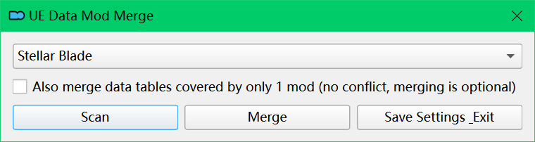

# UE Data Table Merge Tool / UE数据表合并工具

## Introduction / 介绍

When multiple mods modify the same game data table (.uasset) in an Unreal Engine game, only the last loaded mod takes effect. If you, as a discerning player, want to have it all, this tool is here to solve that enormous frustration.

Unreal Engine游戏中有多个mod修改相同的游戏数据表(.uasset)时，只有最后载入的mod才生效；如果作为尊贵的玩家想全都要，这个工具就可以用来解决如此巨大的困扰。

When I had the same need before, I was directed to jpabscale's [automod](https://jpabscale.github.io/automod). His tool can apply JSON patch patterns written in TOML to data tables, and can also diff FModel-extracted data table JSONs to generate patch patterns. However, automod is not easy to use: first, it requires installing about 4GB of Java and Scala dependencies plus nearly 2GB of Stellar Blade source data files; then users need to extract data tables with FModel themselves, and even write JSON patch patterns with a steep learning curve. The most critical issue was that when I solved all the preceding problems and tried to test automod with the smallest Stellar Blade data table, after consuming over 8GB of memory for a minute, — OOM! it reported a pretty Out Of Memory error. Thus my plan to merge mods fell through, and I had to make this tool myself using Python. Of course, I still express great gratitude to jpabscale's work; this tool also uses a bit of his configuration.

之前我有同样需要的时候会被指引去jpabscale的[automod](https://jpabscale.github.io/automod)，他的工具可用来将TOML编写的JSON patch pattern应用到数据表上，也可以将FModel提取的数据表JSON进行差异对比生成patch pattern。然而automod用起来并非易事，首先它需要安装4GB左右大小的Java和Scala依赖加上接近2GB的Stella Blade源数据文件，然后需要用户自己用FModel提取数据表，甚至需要自己编写学习曲线陡峭的JSON patch pattern；最关键的问题是当我解决前面所有问题，尝试用最小的Stella Blade数据表测试automod时，OOM!，在占用超过8GB内存1分钟后，它报告了一个漂亮的Out Of Memory错误，于是我合并mod的计划落空了，只好自己用Python做了这个工具。当然这里还是对jpabscale的工作表示非常感谢，这个工具也使用了一点他的配置。

This tool is prepared for players who completely don't want to study program and technical details. It aims to merge all installed data-conflicting mods with one click (or one command), abandoning patch pattern functionality and TOML intermediate representation. This tool also does not handle other conflicts such as chunk ID overlaps, etc.

这个工具为完全不想研究程序和技术细节的玩家准备，旨在以一键（或一条命令）合并已安装的全部数据冲突mod，放弃了patch pattern功能和TOML中间表示。本工具也不处理其他冲突比如chunk id重合等。

The source code is published on [my Github](https://github.com/lotress/UEDataMerge).

源代码发布在[我的Github](https://github.com/lotress/UEDataMerge)。

## ⚠️ Disclaimer / 注意

This tool only transfers and merges raw data — it does not understand the meaning of any data fields, nor does it perform any semantic validation. It does not guarantee that multiple mods can coexist harmoniously after merging. The merged result may not conform to the design intent of any individual mod. Use at your own risk and always review the merge log to verify the outcome.

本工具仅搬运和合并原始数据，不理解任何数据的含义，也不进行任何语义层面的校验。本工具不保证多个mod合并后能够和谐共存，合并后的效果可能不符合任何mod的设计意图。请自行承担风险，并务必查看合并日志以核实结果。

## Installation / 安装方式

I provide both a standalone command-line program and a [Mod Organizer](https://www.modorganizer.org/) plugin version (heavily modded players should use it). Both download links include the required third-party tool programs, but one third-party program depends on .NET 8.0+, which can be [downloaded here](https://learn.microsoft.com/en-us/dotnet/core/install/). For the standalone program, download the archive and extract it to a regular directory. For the Mod Organizer plugin, extract it under Mod Organizer's `plugins\` directory.

我提供了独立运行的命令行程序和[Mod Organizer](https://www.modorganizer.org/)（heavily modded玩家应该用它）插件版本，两个下载链接都包含了必需的第三方工具程序，但是有个第三方程序依赖.net 8.0+，可以[在这里下载](https://learn.microsoft.com/en-us/dotnet/core/install/)。对于独立程序，下载压缩包后解压到普通目录中，Mod Organizer插件则解压到Mod Organizer的`plugins\`下面。

## Usage / 使用方式

This tool provides two functions: scan and merge. Scan shows which data tables are modified by mods, while merge satisfies the main need — obtaining a new mod that merges all modifications. It is recommended to run a scan before merging to check whether the overriding mods and their order match your expectations, since edits modifying the same game property can only take effect for the last one. If you don't use Mod Organizer, you can only adjust the order by renaming mod files.

这个工具提供两个功能：扫描和合并，扫描显示哪些数据表被mod修改，合并则满足主要需求即获得合并了全部修改的新mod。建议合并前都运行扫描查看一下覆盖mod和顺序是不是符合预期，毕竟修改了同一个游戏属性的编辑肯定只能生效最后一个。如果你不用Mod Organizer那就只能通过重命名mod文件来调整顺序了。

### Standalone Program / 独立程序

Command format:

命令格式：

```bash
UEDataMerge <command> <gameFolder> -g <gameName>
```

Parameters:

参数说明：

| Parameter | Description |
|---|---|
| `<command>` | `scan` or `merge` |
| `<gameFolder>` | Path to the game installation directory |
| `-g <gameName>` | Specify the game name (key in config.json, e.g. `sb`, `soa`, `pal7`, `kena`, `wd`) |
| `-a` | Also include data tables that appear in only one mod (no conflict, merging is optional) |
| `-k` | Keep the generated mod in this tool's output folder (`output/`) instead of installing to the game directory |

| 参数 | 说明 |
|---|---|
| `<command>` | `scan`（扫描）或 `merge`（合并） |
| `<gameFolder>` | 游戏安装目录路径 |
| `-g <gameName>` | 指定游戏名称（config.json中的键名，如 `sb`、`soa`、`pal7`、`kena`、`wd`） |
| `-a` | 也包含仅出现在一个mod中的数据表（无冲突，合并是可选的） |
| `-k` | 将生成的mod保留在本工具的输出文件夹（`output/`）中，而不是安装到游戏目录 |

Examples:

示例：

```bash
# Scan which data tables are modified by mods
# 扫描哪些数据表被mod修改
UEDataMerge scan "C:\Games\Stellar Blade" -g sb

# Merge all conflicting data table mods and install to game directory
# 合并所有冲突的数据表mod并安装到游戏目录
UEDataMerge merge "C:\Games\Stellar Blade" -g sb

# Merge and also include non-conflicting data tables, keep output in tool folder
# 合并，包含无冲突的数据表，保留输出在工具文件夹中
UEDataMerge merge "C:\Games\Stellar Blade" -g sb -a -k
```

### Mod Organizer Plugin / Mod Organizer插件

Click `UE Data Mod Merge` in the toolbar under `Plugins`.

在`工具栏-插件`里点击`UE Data Mod Merge`。



A graphical interface will then pop up.

后弹出图形界面。



Note that the Mod Organizer plugin and the standalone program interpret mod order differently. The standalone program follows Unreal Engine's natural method, using file path string order or pak chunk number order to determine which mod overrides another. The Mod Organizer plugin first follows the priority order of activated mods in the user's profile, and within each mod, arranges by Unreal Engine order internally. The standalone program scans files under the `~mods` directory, while the Mod Organizer plugin only scans activated mods and does not include mods not managed by Mod Organizer (i.e., things already in the `~mods` directory).

注意Mod Organizer插件与独立程序理解mod顺序的方式不同，独立程序就按Unreal Engine的自然方式以文件路径字符串顺序或pakchunk数字顺序决定哪个mod覆盖另一个，Mod Organizer插件则首先按照用户profile的已激活mod的优先级顺序，每个mod内部再按Unreal Engine顺序排列。独立程序扫描~mods目录下的文件，Mod Organizer插件仅扫描已激活mod，不包括Mod Organizer不管理的mod（就是已经在~mods目录下的东西）。

## User Custom Patches / 用户自定义patch

Besides packaged ready-made mods, you can also merge your own data into the generated mod. Just place your data table JSON files with the exact directory structure under the [patches directory](patches), then execute this tool's merge command. You don't need complete JSON data — only the data items you want to modify (indexed by the `Name` property) and their corresponding structure are needed; your JSON files will not be cleared after merging.

除了打包好的现成mod，你也可以将自己的数据合并进mod里，只要将自己的数据表JSON文件包括准确的目录结构放在[patches目录下](patches)，再执行本工具的合并命令即可。你不需要完整的JSON数据，只要有欲修改的数据项（按`Name`属性索引）和相应结构即可；合并后你自己的JSON文件不会被清除。

## Detailed Log / 详细日志

The scan command prints results directly. The merge command writes each modified data item and its value to a log file. The log file is initially generated at `output/log.txt` within this tool's directory. After a successful merge without set `-k` option:

- **Standalone program**: The log file is moved to `<gameFolder>/<GameID>/Content/Paks/~mods/UEDataMerge-<timestamp>.log` alongside the generated mod files.

- **Mod Organizer plugin**: The log file is moved to the created mod's folder in Mod Organizer as `UEDataMerge-<timestamp>.log`.

扫描命令会直接打印结果，合并命令则将每个修改的数据项和值写到日志文件里。日志文件最初生成在本工具目录的 `output/log.txt`。合并成功后若未指定保留选项：

- **独立程序**：日志文件会移动到 `<gameFolder>/<GameID>/Content/Paks/~mods/UEDataMerge-<时间戳>.log`，与生成的mod文件在一起。

- **Mod Organizer插件**：日志文件会移动到Mod Organizer中创建的mod文件夹内，文件名为 `UEDataMerge-<时间戳>.log`。

## Support for Other Games / 对其他游戏的支持

This tool is published as a Stellar Blade mod, but it appears to also work with other Unreal Engine 4 or 5 games. I have retained jpabscale's automod-supported games in the configuration file. If you have other Unreal Engine games, you can try adding them yourself in the [configuration file config.json](config.json). When adding, you need to know the Unreal Engine version your game uses to fill in `engineVersion`, then look at the game directory for the name of the data directory — the one that has Content, Binaries, etc. subdirectories under it — and use its name to fill in ID. To determine whether your game uses zen mode, check if there are files with the `.utoc` extension under the game's data directory\Content\Paks; if so, set `"zen": true`. Finally, some game need a data format .usmap file. If you can't find a ready-made one on [jpabscale's page](https://github.com/jpabscale/automod/releases/tag/usmap), you can launch your game with [UE4SS](https://github.com/UE4SS-RE/RE-UE4SS) and press Ctrl+Numpad 6; a file named `Mappings.usmap` will appear in the `ue4ss` directory. Move this file to this tool's [tools\Data\Mappings](tools/Data/Mappings) directory, then go back to `config.json` and fill in `mapName` with the filename `Mappings` (you can also rename it accordingly).

这个工具作为Stellar Blade的一个mod发布，但看起来也适用于其他Unreal Engine 4或5的游戏，我在配置文件中保留了jpabscale的automod已有支持的游戏。如果你有其他Unreal Engine游戏可以尝试自己在[配置文件config.json](config.json)里添加，添加时你需要知道游戏用的Unreal Engine版本来填写`engineVersion`，再去游戏目录下看看数据目录的名字，就是那个下面有Content, Binaries等目录的地方，用它的名字填写ID，了解你的游戏是否为zen模式，你看一下游戏数据目录\Content\Paks下面有没有扩展名为.utoc的文件，若有就写上`"zen": true`，最后一部分游戏需要数据格式.usmap文件，这个如果在[jpabscale的网页](https://github.com/jpabscale/automod/releases/tag/usmap)上找不到现成的，可以带[UE4SS](https://github.com/UE4SS-RE/RE-UE4SS)启动你的游戏后按Ctrl+数字键盘6，名叫`Mappings.usmap`的文件将出现在`ue4ss`目录中，把这个文件移动到本工具目录的[tools\Data\Mappings](tools/Data/Mappings)下，回到`config.json`，`mapName`就填写文件名`Mappings`，你也可以同步改名。

## Third-Party Programs Used / 用到的第三方程序

The [tools](tools) directory includes:

[retoc](https://gitlab.com/DeronFer/cnsrepacker/-/blob/main/tools/retoc/retoc.exe?ref_type=heads) obtained from [StellarBladeCNSRepacker](https://www.nexusmods.com/stellarblade/mods/1936), used for unpacking/packing zen mode game assets.

trumank's [repak](https://github.com/trumank/repak/releases/tag/v0.2.3), used for unpacking/packing non-zen mode game assets.

atenfyr's [UAssetGUI](https://github.com/atenfyr/UAssetGUI/releases/tag/experimental-latest), used for bidirectional conversion between .uasset and .json.

Thanks to all the above projects.

[tools](tools)目录下包括

从[StellarBladeCNSRepacker](https://www.nexusmods.com/stellarblade/mods/1936)里获取的[retoc](https://gitlab.com/DeronFer/cnsrepacker/-/blob/main/tools/retoc/retoc.exe?ref_type=heads)，用于解包/打包zen模式的游戏资产。

trumank的[repak](https://github.com/trumank/repak/releases/tag/v0.2.3)，用于解包/打包非zen模式的游戏资产。

atenfyr的[UAssetGUI](https://github.com/atenfyr/UAssetGUI/releases/tag/experimental-latest)，用于.uasset与.json双向转换。

向以上所有项目表示感谢。